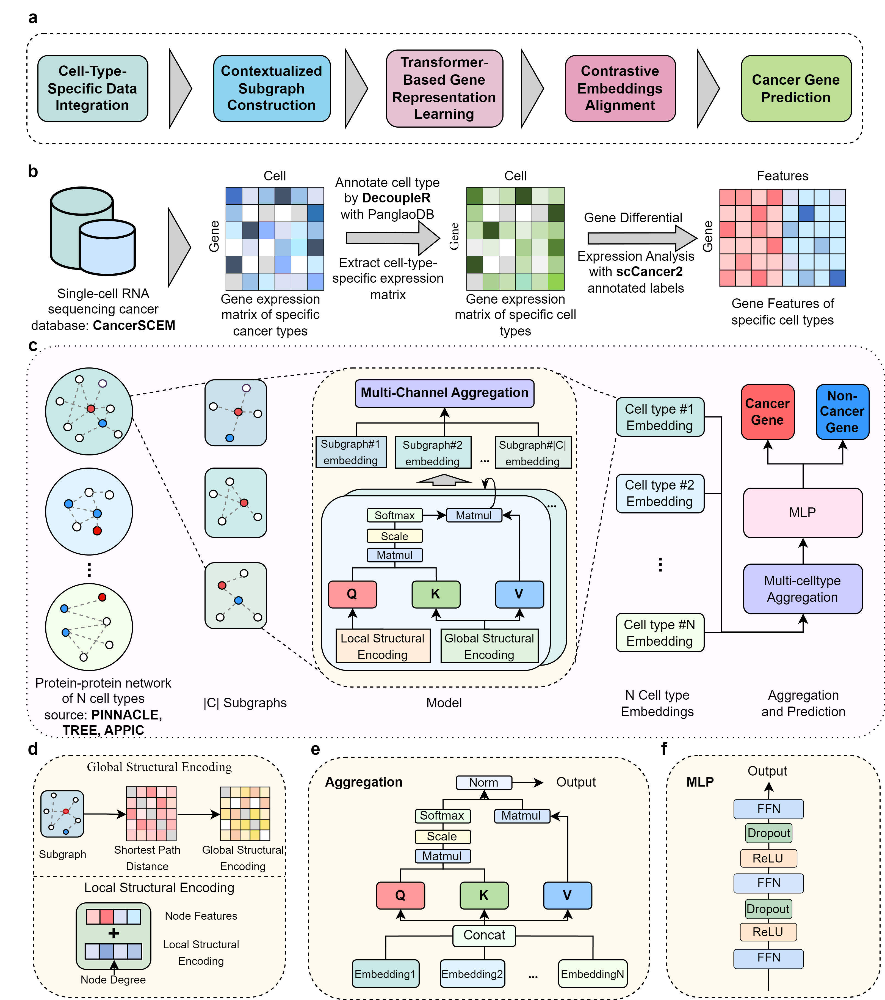

# CCL-CGI

## 1. Model Overview

CCL-CGI is a transformer-based graph neural network designed to leverage cellular heterogeneity through contextualized metric-based contrastive learning, integrating scRNA-seq and PPI network data. The overall framework is shown below, with implementation details provided in the Methods section of the paper.



CCL-CGI contains five key components:

1. **Cell-Type-Specific Data Integration**  
   Gene expression matrices from CancerSCEM are extracted for individual cell types and aligned with PPI networks of protein-coding genes.

2. **Contextualized Subgraph Construction**  
   Differential expression analysis is used to capture heterogeneity between malignant and non-malignant cells. Random walk sampling on contextualized PPI graphs then extracts biologically meaningful subgraphs.

3. **Transformer-Based Gene Representation Learning**  
   Subgraphs are organized into cell-type-specific blocks, and a transformer-style graph encoder with self-attention learns contextualized gene embeddings.

4. **Metric-based Contrastive Embedding Alignment**  
   A metric-based contrastive learning objective aligns embeddings across cellular contexts, producing a unified representation that preserves both shared and cell-type-specific signals.

5. **Cancer Gene Prediction**  
   A classification head (fully connected layers with ReLU activations) estimates cancer-association probabilities for unlabeled genes.

By jointly modeling context-aware PPI topology (global-local perspective) and differential expression signals, CCL-CGI learns a unified latent space that supports knowledge transfer between malignant and non-malignant cells and improves cancer gene identification.

In the original study, CCL-CGI showed strong performance on a large-scale benchmark and demonstrated robustness under gene perturbation noise. It also highlighted interpretable gene–cell-type relationships and identified novel candidate cancer genes for downstream biological validation.

## 2. Setup (based on `pyproject.toml`)

### 2.1 Environment

```bash
python3.10 -m venv .venv
source .venv/bin/activate
python -m pip install -U pip
python -m pip install uv
```

### 2.2 Install dependencies (single dependency file: `pyproject.toml`)

```bash
uv sync  # installs all project dependencies defined in pyproject.toml
```

### 2.3 Data preparation

1. Download and unzip the dataset into `h5/CCL-CGI/` (put `global_ppi.h5` and per-cell-type `.h5` files in the same folder).
2. Intermediate computation files are expected in:
   - `pdata/CCL-CGI/`
   - `sp/CCL-CGI/`


## 3. Run Command (CCL-CGI only)

```bash
python run.py \
  --dataset_name CCL-CGI \
  --n_cell_types 39 \
  --cv_folds 10 \
  --spatial rw \
  --n_graphs 6 \
  --n_neighbors 8 \
  --n_layers 3 \
  --dff 8 \
  --d_sp_enc 64 \
  --lr 0.005 \
  --dropout 0.5 \
  --loss_mul 0.2 \
  --bz 256 \
  --h5_dir ./h5/CCL-CGI \
  --data_dir ./pdata/CCL-CGI \
  --sp_dir ./sp/CCL-CGI \
  --gpu 0 \
  --seed 42
```

Optional threshold behavior:

- Default: fixed threshold `0.5`
- Add `--auto_threshold_by_val_f1` to select threshold automatically by validation F1

## 4. Dataset Information (CCL-CGI)

The following statistics are based on `global_ppi.h5`:

- Total genes: `12,956`
- Labeled genes: `3,091`
- Positive genes: `783`
- Negative genes: `2,308`
- Number of cell types: `39`

### 4.1 Data split

- Original split:
  - `train = 2,086`
  - `val = 231`
  - `test = 774`
- In training, `train + val` are merged into one training pool (`2,317`), while test stays `774`.
- Training pool : test set ≈ `74.96% : 25.04%` (on labeled genes).
- 10-fold cross-validation is performed on the training pool.


## 5. Run Directly from Checkpoints and View Performance

You can directly evaluate from a specified checkpoint path (no training):

```bash
python run.py \
  --dataset_name CCL-CGI \
  --n_cell_types 39 \
  --fold_idx 8 \
  --model_name CCL_CGI \
  --checkpoint_path ./checkpoint/CCL_CGI_ckpt.pkl \
  --h5_dir ./h5/CCL-CGI \
  --data_dir ./pdata/CCL-CGI \
  --sp_dir ./sp/CCL-CGI \
  --gpu 0 \
  --seed 42
```

For multi-fold evaluation with different checkpoints, use a template path containing `{fold}` (for example `./checkpoint/your_model_fold_{fold}.pkl`).

If you want automatic threshold tuning from validation F1 during checkpoint evaluation, append:

```bash
--auto_threshold_by_val_f1
```

Model performance is written to:

- `log/CCL_CGI_performance_CCL_CGI.csv`


## 6. Intermediate Computation Files

- `pdata/CCL-CGI/`:
  - `*_adj.npy`
  - `*_feature.npy`
  - `*_subgraphs.npy`
  - `*_spatial.npy`
- `sp/CCL-CGI/`:
  - `*_sp.h5` (shortest-path cache files)


## 7. Configurable Arguments

Commonly used arguments include:

- Graph construction: `--n_graphs`, `--n_neighbors`, `--n_layers`, `--spatial`
- Model architecture: `--dff`, `--d_sp_enc`, `--num_heads`
- Training: `--lr`, `--dropout`, `--loss_mul`, `--bz`, `--cv_folds`
- Data: `--dataset_name`, `--n_cell_types`, `--h5_dir`, `--data_dir`, `--sp_dir`
- Runtime control: `--gpu`, `--seed`, `--fold_idx`, `--test_run`, `--reuse_checkpoint`, `--checkpoint_path`, `--auto_threshold_by_val_f1`

Threshold policy:

- Default (no flag): fixed threshold `0.5`
- With `--auto_threshold_by_val_f1`: automatically select the best threshold on the validation split by F1 score


## 8. Reproducibility

- Default random seed: `42`
- Reproduce runs by explicitly setting `--seed 42` in commands
- Small metric differences may still appear across hardware/library versions

## 9. Training Time and GPU Memory

- Hardware: single A100 GPU
- Training time: around `1-2` hours per fold
- GPU memory usage: around `3 GB`


## 10. Extract Attention Weights

You can extract per-gene cell-type attention scores from a trained checkpoint using:

`tools/extract_attention_weights.py`

Example:

```bash
python tools/extract_attention_weights.py \
  --checkpoint_path checkpoint/CCL_CGI_ckpt.pkl \
  --data_dir ./pdata/CCL-CGI \
  --global_ppi_h5 ./h5/CCL-CGI/global_ppi.h5 \
  --genes VAV1 TP53 BRCA1 \
  --merge_subtypes \
  --output_csv outputs/attention_scores.csv \
  --heatmap_path outputs/attention_heatmap.png
```

Notes:

- If `--genes` and `--gene_file` are both omitted, the script uses all positive genes in the test split.
- `--merge_subtypes` merges subtype columns (e.g., `T cells1/2/3`) into grouped columns.
- You can save raw per-gene attention tensors with `--save_raw_dir`.
- The checkpoint and extraction hyperparameters (`--d_model`, `--n_layers`, `--n_graphs`, `--n_neighbors`, etc.) must match the trained model.
