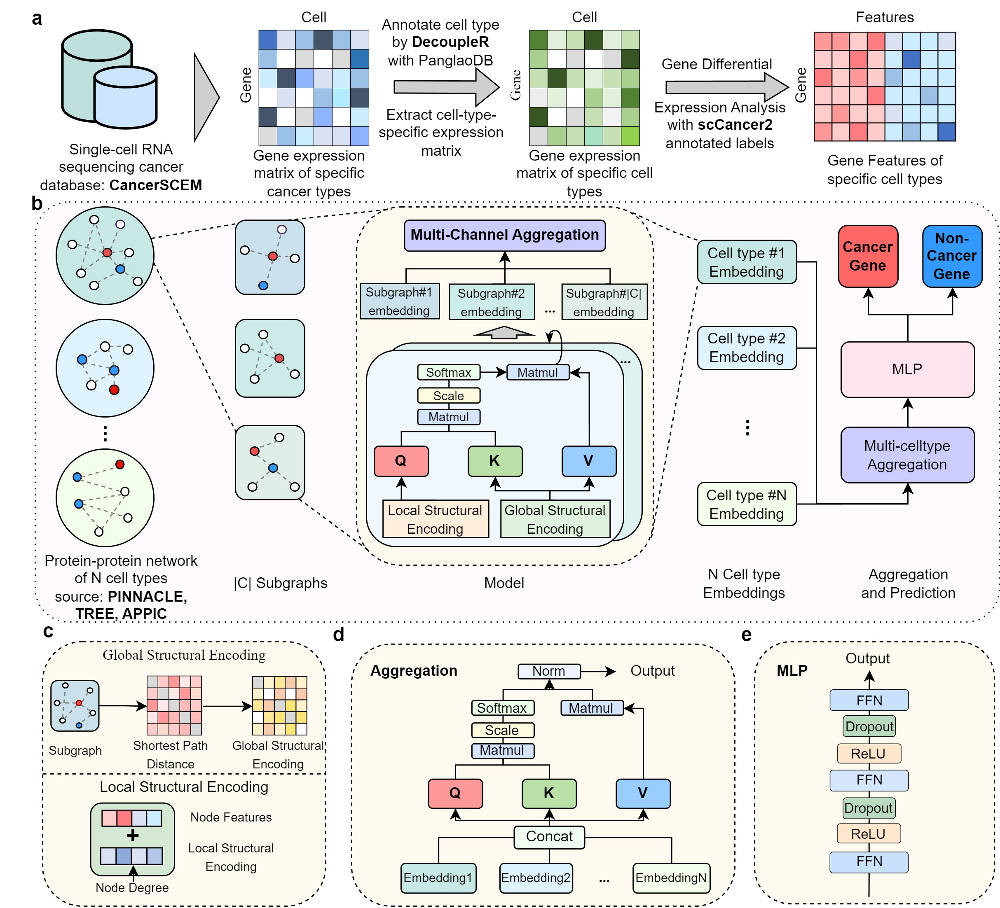

# CCL-CGI: Contextualized Metric-based Contrastive Learning Framework for Cancer Gene Identification

## Model Overview

CCL-CGI is a graph transformer-based network designed to leverage cellular heterogeneity through contextualized metric-based contrastive learning, integrating scRNA-seq and PPI network data. The overall framework is shown below:

<p align="center">
  
</p>

CCL-CGI contains five key components:

1. **Cell-Type-Specific Data Integration (Preprocessing, datasets provided)**
   Gene expression matrices from CancerSCEM are extracted for individual cell types and aligned with PPI networks of protein-coding genes. Differential expression analysis is used to capture heterogeneity between malignant and non-malignant cells. 

2. **Contextualized Subgraph Construction**
   Random walk sampling on contextualized PPI graphs then extracts biologically meaningful subgraphs.

3. **Transformer-Based Gene Representation Learning**
   Subgraphs are organized into cell-type-specific blocks, and a transformer-style graph encoder with hierarchical attention mechanisms (co-attention and self-attention) learns contextualized gene embeddings.

4. **Metric-based Contrastive Embedding Alignment**
   A metric-based contrastive learning objective aligns embeddings across cellular contexts, producing a unified representation that preserves both shared and cell-type-specific signals.

5. **Cancer Gene Prediction**
   A classification head estimates cancer-association probabilities for unlabeled genes.

By jointly modeling context-aware PPI topology (global-local perspective) and differential expression signals, CCL-CGI learns a unified latent space that supports knowledge transfer between malignant and non-malignant cells and improves cancer gene identification.

In the study, CCL-CGI showed strong performance on a large-scale benchmark and demonstrated robustness under gene perturbation noise. It also highlighted interpretable gene–cell-type relationships and identified novel candidate cancer genes for downstream biological validation.

## Setup (based on `pyproject.toml`)

### Environment Setup

```bash
python -m venv ccl-cgi
source ccl-cgi/bin/activate
python -m pip install -U pip
python -m pip install uv
```

### Install dependencies (single dependency file: `pyproject.toml`)

```bash
uv sync  # installs all project dependencies defined in pyproject.toml
```

### Data preparation

For dataset `CCL-CGI`:
1. Unzip the dataset into `h5/CCL-CGI/`: `tar -xzf h5/CCL-CGI/h5_CCL-CGI.tar.gz -C h5/CCL-CGI --strip-components=1`
2. Intermediate computation files are expected in:
   - `pdata/CCL-CGI/` (unzip the pdata `pdata_CCL-CGI.tar.gz` or generate by code)
   - `sp/CCL-CGI/` (create the `sp` folder first, then download the sp data at [figshare](https://figshare.com/articles/dataset/CCL_CGI_h5_tar_gz/28777580?file=53613494) and unzip into this folder or generate by code)

## Run Command

For our main dataset CCL-CGI:
```bash
python run.py --dataset_name CCL-CGI --n_cell_types 39 --cv_folds 10 --spatial rw --n_graphs 6 --n_neighbors 8 --n_layers 3 --dff 8 --d_sp_enc 64 --lr 0.005 --dropout 0.5 --loss_mul 0.2 --bz 256 --h5_dir ./h5/CCL-CGI --data_dir ./pdata/CCL-CGI --sp_dir ./sp/CCL-CGI --gpu 0 --seed 42
```

Optional threshold behavior:

- Default: fixed threshold `0.5`
- Add `--auto_threshold_by_val_f1` to select threshold automatically by validation F1

## Quick Check 

### Run only one fold

```bash
python run.py --dataset_name CCL-CGI --n_cell_types 39 --fold_idx 8 --cv_folds 10 --spatial rw --n_graphs 6 --n_neighbors 8 --n_layers 3 --dff 8 --d_sp_enc 64 --lr 0.005 --dropout 0.5 --loss_mul 0.2 --bz 256 --h5_dir ./h5/CCL-CGI --data_dir ./pdata/CCL-CGI --sp_dir ./sp/CCL-CGI --gpu 0 --seed 42
```

### Run Directly from Checkpoints to View Performance

We provide the trained model checkpoint and you can directly evaluate from the checkpoint path (no training):

```bash
python run.py --dataset_name CCL-CGI --n_cell_types 39 --fold_idx 8 --model_name CCL_CGI --checkpoint_path ./checkpoint/CCL_CGI_ckpt.pkl --h5_dir ./h5/CCL-CGI --data_dir ./pdata/CCL-CGI --sp_dir ./sp/CCL-CGI --gpu 0 --seed 42
```

If you want automatic threshold tuning from validation F1 during checkpoint evaluation, append:

```bash
--auto_threshold_by_val_f1
```

Model performance is written to:

- `log/CCL_CGI_performance_CCL_CGI.csv`

## Reproducibility

### Seed

- Default random seed: `42`
- Reproduce runs by explicitly setting `--seed 42` in commands
- Small metric differences may still appear across hardware/library versions

### Training Time and GPU Memory

- Hardware: single A100 GPU
- Training time: around `1-2` hours per fold
- GPU memory usage: around `3 GB`
- Note: CPU fallback is supported, but CPU-only training is not recommended for full runs. On our test server (Intel(R) Xeon(R) Silver 4210R CPU @ 2.40GHz), one epoch takes about 40 minutes.

## Extract Attention Weights

You can extract per-gene cell-type attention scores from a trained checkpoint using:

`tools/extract_attention_weights.py`

Example:

```bash
python tools/extract_attention_weights.py --checkpoint_path checkpoint/CCL_CGI_ckpt.pkl --data_dir ./pdata/CCL-CGI --global_ppi_h5 ./h5/CCL-CGI/global_ppi.h5 --genes VAV1 TP53 BRCA1 --merge_subtypes --output_csv outputs/attention_scores.csv --heatmap_path outputs/attention_heatmap.png
```

Notes:

- If `--genes` and `--gene_file` are both omitted, the script uses all positive genes in the test split.
- `--merge_subtypes` merges subtype columns (e.g., `T cells1/2/3`) into grouped columns.
- You can save raw per-gene attention tensors with `--save_raw_dir`.
- The checkpoint and extraction hyperparameters (`--d_model`, `--n_layers`, `--n_graphs`, `--n_neighbors`, etc.) must match the trained model.

## Further related files and documents

- Dataset Information [`doc/CCL-CGI_DATASET_INFO.md`](doc/CCL-CGI_DATASET_INFO.md)
- Intermediate Computation Files [`doc/CCL-CGI_INTERMEDIATE_FILES.md`](doc/CCL-CGI_INTERMEDIATE_FILES.md)
- Configurable Arguments [`doc/CCL-CGI_CONFIGURABLE_ARGUMENTS.md`](doc/CCL-CGI_CONFIGURABLE_ARGUMENTS.md)
- Model Card [`doc/modelcard.md`](doc/modelcard.md)
- Reproducibility for additional datasets [`doc/Additional_Datasets_Reproducibility`](doc/Additional_Datasets_Reproducibility.md)
- Attention Weights and prediction score are stored in `related_files`
